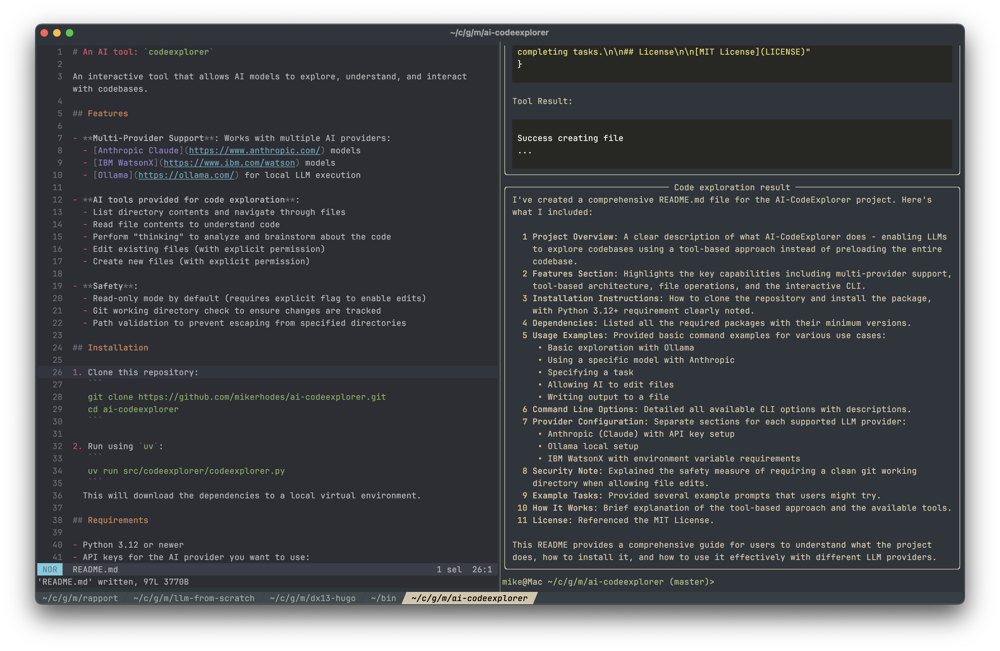

# An AI tool: `codeexplorer`

An interactive tool that allows AI models to explore, understand, and interact with codebases. 



## Features

- **Multi-Provider Support**: Works with multiple AI providers:
  - [Anthropic Claude](https://www.anthropic.com/) models
  - [IBM WatsonX](https://www.ibm.com/watson) models
  - [Ollama](https://ollama.com/) for local LLM execution
  
- **AI tools provided for code exploration**:
  - List directory contents and navigate through files
  - Read file contents to understand code
  - Perform "thinking" to analyze and brainstorm about the code
  - Edit existing files (with explicit permission)
  - Create new files (with explicit permission)

- **Safety**:
  - Read-only mode by default (requires explicit flag to enable edits)
  - Git working directory check to ensure changes are tracked
  - Path validation to prevent escaping from specified directories

## Running `codeexplorer`

There are a few ways to try out `codeexplorer`.

### Requirements

- Python 3.12 or newer
- API keys for the AI provider you want to use:
  - Set `ANTHROPIC_API_KEY` environment variable for Anthropic Claude.
  - Set `WATSONX_IAM_API_KEY`, `WATSONX_PROJECT`, and `WATSONX_URL` for IBM WatsonX.
  - Ollama requires a running local server on the default port.

### Quick run using `uv`

`codeexplorer` can be run direct from the GitHub repository using:

```
uv run --no-project \
    --with git+https://github.com/mikerhodes/ai-codeexplorer \
    codeexplorer \
    -p anthropic \
    --allow-edits \
    -t "Please update the README for this project" \
    .
```

### Clone and run

To develop the code locally, you can clone the code and run it:

1. Clone this repository:
   ```
   git clone https://github.com/mikerhodes/ai-codeexplorer.git
   cd ai-codeexplorer
   ```

2. Run using `uv`:
   ```
   uv run codeexplorer
   ```
  This will download the dependencies to a local virtual environment.


## Usage

Basic usage:

```bash
# Explore the current directory with Ollama
uv run src/codeexplorer/codeexplorer.py -p ollama .

# Use Anthropic models to explore a specific project
uv run src/codeexplorer/codeexplorer.py -p anthropic -m claude-3-7-sonnet-latest ~/projects/myapp

# Allow the AI to make changes (only on clean git repositories)
uv run src/codeexplorer/codeexplorer.py -p ollama --allow-edits [path]

# Specify a task
uv run src/codeexplorer/codeexplorer.py -p ollama -t "Explain how the authentication system works" [path]

# Limit the conversation to fewer turns
uv run src/codeexplorer/codeexplorer.py -p ollama -n 10 [path]

# Save the AI's final output to a file
uv run src/codeexplorer/codeexplorer.py -p anthropic -o results.md [path]
```

### Command-line arguments

```
-n, --num-turns       Number of turns (default: 20)
-p, --provider        Model provider (ollama, anthropic, watsonx)
-m, --model           Specific model to use (provider-specific defaults otherwise)
-e, --allow-edits     Allow model to create and edit files (default: false)
-t, --task            Task to complete using codebase (prompts user if not provided)
-o, --output          Write final output to specified file
path                  Path to explore (default: current directory)
```

## Example use cases

- **Code Understanding**: Navigate large unfamiliar codebases quickly
- **Documentation Generation**: Create documentation based on the codebase
- **Bug Identification**: Ask the AI to find and explain bugs
- **Refactoring Planning**: Get suggestions for code improvements
- **Feature Implementation**: Have the AI guide you through adding new features
- **Learning**: Use the AI to explain complex patterns or algorithms in the code

## How it works

`codeexplorer` implements a simple agent that allows language models to explore a codebase using tools. The AI can navigate through files, read content, and understand the codebase incrementally, just like a human developer. Frankly this code is really simple, because the models are so smart!

When edits are allowed (with the `--allow-edits` flag), the AI can make changes to files or create new ones, but only if the working directory is under git version control and clean before the model starts to edit.

---

Built with :heart: by [Mike Rhodes](https://dx13.co.uk/)
