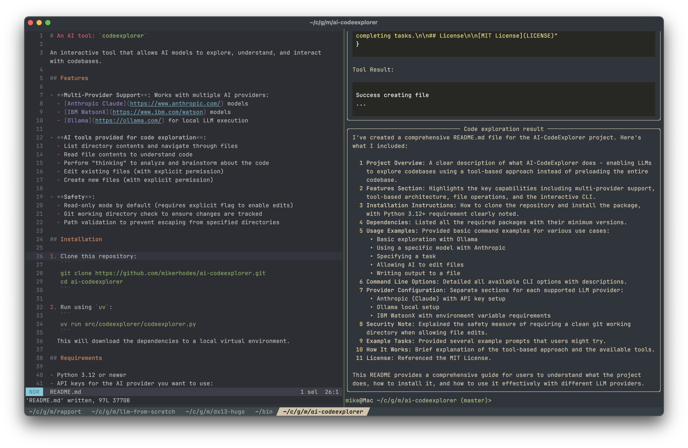

# An AI tool: `codeexplorer`

An interactive tool that allows AI models to explore, understand, and interact with codebases.

It's not the most sophisticated tool ever written, but it doesn't have to be, because new AI models are pretty smart instead. Provide them just a few tools, and they can do the rest. So that's what this application does, as an experiment in how far a simple script can take you.



## Features

- **Multi-Provider Support**: Works with multiple AI providers:
  - [Anthropic Claude](https://www.anthropic.com/) models
  - [IBM WatsonX](https://www.ibm.com/watson) models
  - [Ollama](https://ollama.com/) for local LLM execution

- **AI Tools for Code Exploration**:
  - List directory contents and navigate files
  - Read file contents to understand code structure
  - Analyze and brainstorm through structured thinking
  - Edit existing files (with explicit permission)
  - Create new files (with explicit permission)

- **Safety Features**:
  - Read-only mode by default (requires explicit flag for edits)
  - Git working directory verification to ensure change tracking
  - Path validation to prevent directory traversal attacks

## Running `codeexplorer`

`codeexplorer` offers several installation and usage methods.

### Requirements

- Python 3.12 or newer
- API keys for your chosen AI provider:
  - Set `ANTHROPIC_API_KEY` environment variable for Anthropic Claude
  - Set `WATSONX_IAM_API_KEY`, `WATSONX_PROJECT`, and `WATSONX_URL` for IBM WatsonX
  - Run Ollama local server on the default port

### Quick run using `uv`

Run `codeexplorer` directly from the GitHub repository:

```
uv run \
    --isolated \
    --with git+https://github.com/mikerhodes/ai-codeexplorer \
    codeexplorer \
    --provider anthropic \
    --allow-edits \
    --chat \
    --task "Please update the README for this project" \
    .
```

### Clone and run

For local development, clone and run the repository:

1. Clone this repository:
   ```
   git clone https://github.com/mikerhodes/ai-codeexplorer.git
   cd ai-codeexplorer
   ```

2. Run using `uv`:
   ```
   uv run codeexplorer
   ```
   This downloads dependencies to a local virtual environment.


## Usage

Basic usage:

```bash
# Explore the current directory with Ollama
uv run codeexplorer.py -p ollama .

# Explore the current directory with Ollama and
# continue chatting with the model
uv run codeexplorer.py -c -p ollama .

# Use Anthropic models to explore a specific project
uv run codeexplorer.py -p anthropic -m claude-3-7-sonnet-latest ~/projects/myapp

# Allow AI to make changes (requires clean git repository)
uv run codeexplorer.py -p ollama --allow-edits [path]

# Specify a task
uv run codeexplorer.py -p ollama -t "Explain how the authentication system works" [path]

# Limit the conversation to fewer turns
uv run codeexplorer.py -p ollama -n 10 [path]

# Save AI's final output to a file
uv run codeexplorer.py -p anthropic -o results.md [path]
```

### Command-line arguments

```
-n, --num-turns       Number of turns (default: 20)
-c, --chat            Enable chat mode to continue conversation with model (default: false)
-p, --provider        Model provider (ollama, anthropic, watsonx)
-m, --model           Specific model name (uses provider defaults otherwise)
-e, --allow-edits     Allow model to create and edit files (default: false)
-t, --task            Task for codebase exploration (prompts user if omitted)
-o, --output          Write final output to specified file
path                  Path to explore (default: current directory)
```

## Example use cases

- **Code Understanding**: Navigate large, unfamiliar codebases efficiently
- **Documentation Generation**: Create comprehensive documentation from code analysis
- **Bug Identification**: Identify and explain bugs through AI analysis
- **Refactoring Planning**: Receive targeted suggestions for code improvements
- **Feature Implementation**: Get guided assistance for adding new features
- **Learning**: Understand complex patterns and algorithms through AI explanation

## How it works

`codeexplorer` implements a simple agent that equips language models with tools for codebase exploration. AI models navigate files, read content, and understand code structure incrementally, mirroring human developer workflows. The implementation remains minimal because modern language models handle complex reasoning independently.

When you enable edits with the `--allow-edits` flag, the AI can modify existing files or create new ones. However, the system requires a clean git working directory before allowing any modifications, ensuring all changes remain tracked and reversible.

## Contributing

See [DEVELOPING.md](./DEVELOPING.md) for more details on contributing.

---

Built with :heart: by [Mike Rhodes](https://dx13.co.uk/)
